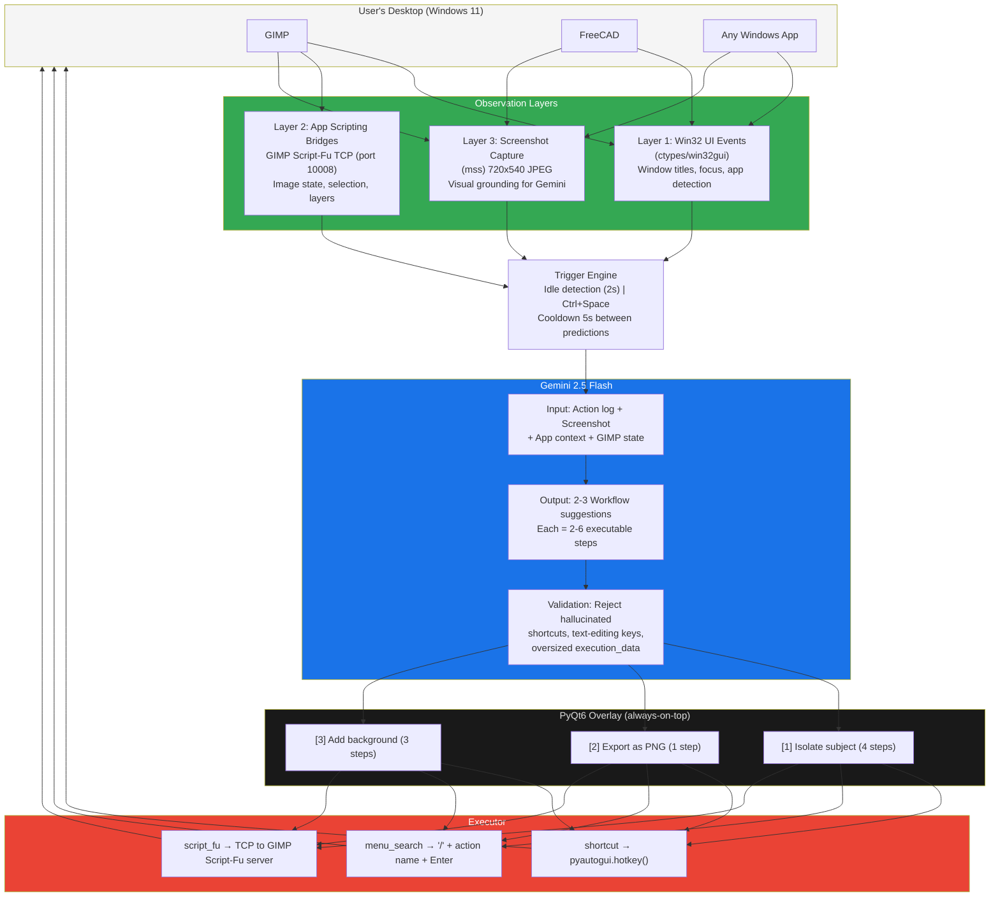

# Understudy -- Architecture

## Data Flow

1. User works normally in any Windows application
2. Understudy observes via 3 layers (events + bridge + screenshot)
3. On idle (2s) or Ctrl+Space, context is sent to Gemini 2.5 Flash
4. Gemini returns 2-3 multi-step workflow suggestions
5. Suggestions validated (reject hallucinated shortcuts)
6. Overlay shows suggestions; user picks one with keyboard or click
7. Executor runs the workflow: shortcuts, menu search, or Script-Fu
8. Cycle repeats -- new suggestions appear based on updated context
